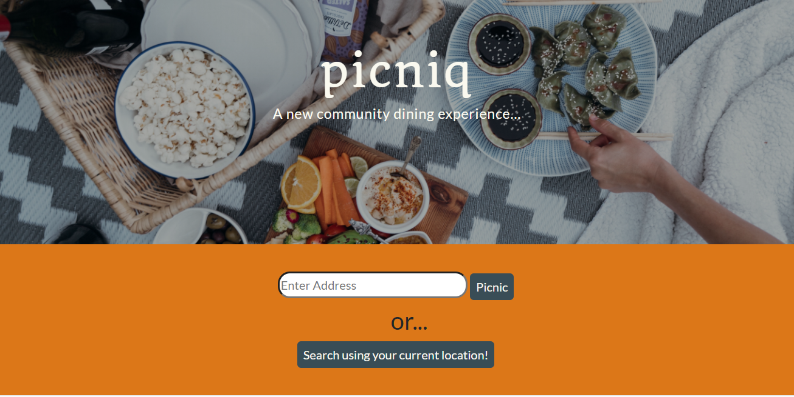
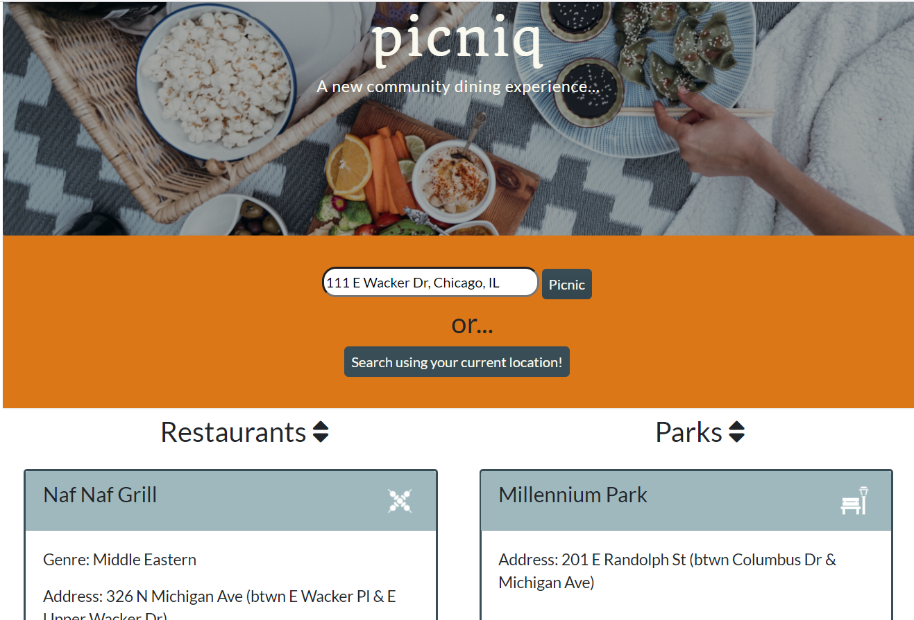
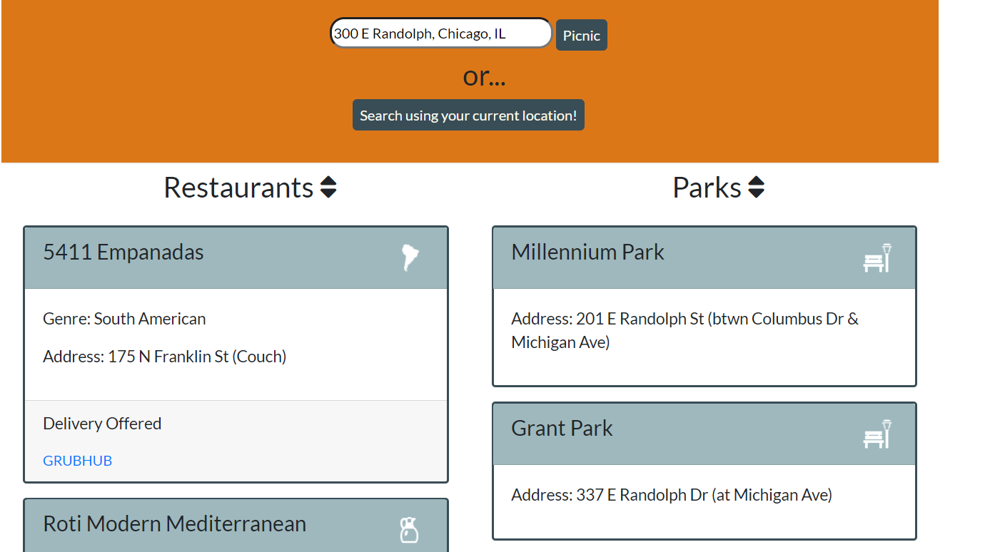

# Picniq
This application is a dynamic platform, designed to provide the nearest parks and restaurants based on the users’ location.

## Deployed Application

**Picniq App!**
[https://jpbrickhouse.github.io/Picniq/](https://jpbrickhouse.github.io/Picniq/)

## Motivation
During the COVID-19 pandemic, locally-owned restaurants and bars have been forced to rethink their entire operation. While they are unable to provide the same indoor dining experiences, they are still operating via delivery and takeout. Our Picniq app opens up a new world of dining opportunities: local food delivered directly to neighborhood parks, creating a unique, socially-distant dining experience.

## Screenshots
### Landing Page

### Results, example v1

### Results, example v2

## Features
The Picniq allows for two forms of location input: current location (based on the user’s browser) or input address (based on any desired location). The search results are provided by FourSquare and are based on proximity, ensuring that only the nearest restaurants and parks are provided to the user. Within the results for each restaurant, a link is provided to connect the users to a delivery service.

## Code Notes:
The backbone of Picniq’s functionality was constructed with Javascript and jQuery, several APIs, and built-in browser functions:
- If a user selects their current location, the browser calculates their latitude and longitude based on their IP address. However, if the user searches by address – perhaps to search for restaurants or parks near the address of a friend! – the address is fed via AJAX call into the OpenCage Geocoder API, which returns the latitude and longitude.
- The latitude and longitude – regardless of source – is then fed (pun intended) via AJAX call into the API for FourSquare. Parsing through the results of the FourSquare API JSON allows us to return a bevy of useful information to the user. This includes, but is not limited to, the following:
    - Restaurant Name and Address
    - Genre of food (Asian, Latin American, German, etc.)
    - Whether or not delivery is offered? (Some restaurants unfortunately do not offer delivery… But for those that do – which is the majority! – a direct link is provided to the restaurant’s associated GrubHub Page.)
    - Park Name and Address
    - Helpful information regarding the location and type of park (Playground, Dog Park, Community Park)
- All this information is indispensable for the user’s pandemic picnic planning needs!
- But good data alone does not necessarily make a good app. That’s where our simple design interface has a chance to shine! Utilizing a combination of CDN libraries – PureCSS, Bootstrap, GoogleFonts – and our own CSS styles, we built a responsive webpage, displaying the content efficiently on mobile or desktop devices.
- And of course, a great website needs a clever name and great header image. Our main hero jumbotron image was sourced from Pexels, a royalty free photo website. And our app’s name – Picniq, with the Q for Quarantine – was a collaborative decision, based on our collective experiences and desires to safely socialize with our friends.

## API Reference
This application uses the FourSquare and OpenCage Geocoder APIs to render the results based on the user location:
[FourSquare](https://developer.foursquare.com/))
[OpenCage Geocoder](https://opencagedata.com/)

## Credits
The Picniq app was made possible with the help of FourSquare, OpenCage Geocoder, PureCSS, Bootstrap, and GoogleFonts. 

## License
[Open Source Initiative - MIT License](https://opensource.org/licenses/MIT)

Copyright 2020.

Permission is hereby granted, free of charge, to any person obtaining a copy of this software and associated documentation files (the "Software"), to deal in the Software without restriction, including without limitation the rights to use, copy, modify, merge, publish, distribute, sublicense, and/or sell copies of the Software, and to permit persons to whom the Software is furnished to do so, subject to the following conditions:

The above copyright notice and this permission notice shall be included in all copies or substantial portions of the Software.

THE SOFTWARE IS PROVIDED "AS IS", WITHOUT WARRANTY OF ANY KIND, EXPRESS OR IMPLIED, INCLUDING BUT NOT LIMITED TO THE WARRANTIES OF MERCHANTABILITY, FITNESS FOR A PARTICULAR PURPOSE AND NONINFRINGEMENT. IN NO EVENT SHALL THE AUTHORS OR COPYRIGHT HOLDERS BE LIABLE FOR ANY CLAIM, DAMAGES OR OTHER LIABILITY, WHETHER IN AN ACTION OF CONTRACT, TORT OR OTHERWISE, ARISING FROM, OUT OF OR IN CONNECTION WITH THE SOFTWARE OR THE USE OR OTHER DEALINGS IN THE SOFTWARE.
